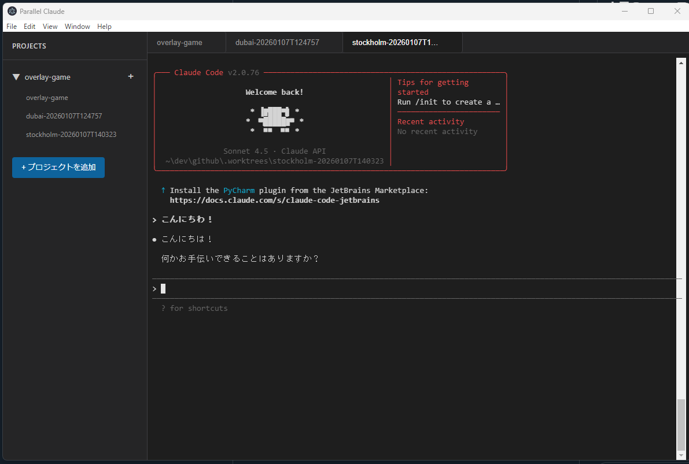

# Parallel Claude

Windows向けのGit Worktree管理＆Claude Code CLI統合デスクトップアプリケーション



## 概要

Parallel Claudeは、複数のgit worktreeを効率的に管理し、それぞれのworktreeでClaude Code CLIを即座に起動できるElectronベースのデスクトップアプリケーションです。macOSの「conductor」に着想を得て、Windows環境向けに設計されています。

## 主な機能

- 🗂️ **プロジェクト管理**: gitリポジトリを簡単に追加・管理
- 🌍 **Worktree作成**: ランダムな都市名で新しいworktreeを自動生成（例: `tokyo-20260107T123456`）
- 💻 **統合ターミナル**: worktreeをクリックするだけでClaude CLIが自動起動
- 📑 **タブ管理**: 複数のworktreeを同時に開いてタブで切り替え
- 🎨 **ダークテーマ**: 目に優しいダークモードUI

## 技術スタック

- **Electron** - デスクトップアプリケーションフレームワーク
- **React 18** - UIライブラリ
- **TypeScript** - 型安全性
- **Vite** - 高速ビルドツール
- **xterm.js** - ターミナルエミュレータ
- **node-pty** - ネイティブ疑似端末サポート

## 前提条件

### 必須
- **Node.js**: v16以上
- **npm**: v8以上
- **Git**: 2.5以上（git worktreeサポート）
- **Claude Code CLI**: インストール済みで`claude`コマンドが使える状態
- **Visual Studio Build Tools 2022**: node-ptyのネイティブビルドに必要

### Visual Studio Build Tools 2022のインストール

node-ptyはネイティブアドオンのため、C++コンパイラが必要です：

1. [Visual Studio Build Tools 2022](https://visualstudio.microsoft.com/downloads/#build-tools-for-visual-studio-2022)をダウンロード
2. インストーラーで以下のコンポーネントを選択：
   - ✅ **MSVC v143 - VS 2022 C++ x64/x86 ビルド ツール (最新)**
   - ✅ **Windows 11 SDK** (または Windows 10 SDK)
   - ✅ **MSVC v143 - VS 2022 C++ x64/x86 Spectre 軽減ライブラリ (最新)**

3. インストール完了後、PowerShellを再起動

## セットアップ

### 1. リポジトリのクローン

```bash
git clone https://github.com/yourusername/parallel-claude.git
cd parallel-claude
```

### 2. 依存関係のインストール

```bash
npm install
```

### 3. node-ptyのリビルド

**重要**: 必ずPowerShellで実行してください（Git Bashでは失敗します）

```powershell
npx @electron/rebuild -f -w node-pty
```

成功すると `√ Rebuild Complete` と表示されます。

### 4. TypeScriptのビルド

```bash
npm run build:electron
```

### 5. 開発サーバーの起動

```bash
npm run dev
```

アプリケーションウィンドウが自動的に開きます。

## 使い方

### プロジェクトの追加

1. 左サイドバーの「**+プロジェクトを追加**」ボタンをクリック
2. gitリポジトリのフォルダを選択
3. プロジェクトと既存のworktreeが自動的に読み込まれます

### Worktreeの作成

1. プロジェクト名の右側にある「**+**」ボタンをクリック
2. ランダムな都市名でworktreeが作成されます（例: `dubai-20260107T124757`）
3. デフォルトでは `.worktrees/` フォルダに作成されます

### ターミナルの使用

1. worktree名をクリック
2. 新しいタブが開き、ターミナルが表示されます
3. Claude CLIが自動的に起動します（`claude`コマンドが実行されます）
4. 通常のターミナルとして使用できます

### Worktreeの削除

1. worktree名の右側にある「**🗑️**」ボタンをクリック
2. 確認ダイアログで「OK」をクリック
3. worktreeとファイルが削除されます

## デバッグ方法

### 開発者ツールを開く

アプリケーション起動後、以下のショートカットで開発者ツールを開けます：

- **Windows/Linux**: `Ctrl + Shift + I` または `F12`
- メニューバー: `View` → `Toggle Developer Tools`

### よくある問題と解決方法

#### 1. ターミナルが「Process exited with code undefined」と表示される

**原因**: node-ptyが正しくビルドされていない

**解決方法**:
```powershell
# PowerShellで実行（Git Bashは不可）
cd C:\Users\あなたのユーザー名\path\to\parallel-claude
npx @electron/rebuild -f -w node-pty
```

ビルド成果物を確認：
```bash
ls node_modules/node-pty/build/Release/
# pty.node, winpty.dll, winpty-agent.exe が存在するはず
```

#### 2. 「GetCommitHash.bat is not recognized」エラー

**原因**: Git Bashでリビルドを実行している

**解決方法**: PowerShellで実行してください

#### 3. 「Could not find any Visual Studio installation」エラー

**原因**: Visual Studio Build Toolsがインストールされていない

**解決方法**: 上記の「Visual Studio Build Tools 2022のインストール」セクションを参照

#### 4. React StrictModeによる二重実行

**原因**: React 18のStrictModeが開発環境でuseEffectを2回実行

**解決方法**: `src/renderer/src/main.tsx`でStrictModeを無効化（既に対応済み）

```tsx
// ❌ これはNG（二重実行される）
<React.StrictMode>
  <App />
</React.StrictMode>

// ✅ これでOK
<AppProvider>
  <App />
</AppProvider>
```

#### 5. ポート5173が既に使用中

**原因**: 前回のViteサーバーが残っている

**解決方法**:
```bash
# プロセスIDを確認
netstat -ano | findstr :5173

# プロセスを終了（PIDを置き換え）
taskkill /F /PID <PID>
```

### ログの確認方法

#### Electronメインプロセスのログ

開発者ツールの「Console」タブに表示されます：

```
[Terminal] Creating terminal <id> at <path>
[Terminal] Using shell: C:\WINDOWS\system32\cmd.exe
[Terminal] Executing claude command in <id>
[Terminal] Terminal <id> exited with code <code>
```

#### Reactレンダラープロセスのログ

開発者ツールの「Console」タブに表示されます：

```
[Terminal UI] Initializing terminal <id>
[Terminal UI] Terminal <id> created successfully
```

### node-ptyの動作確認

簡単なテストスクリプトで確認：

```javascript
// test-pty.js
const pty = require('node-pty');

const shell = process.platform === 'win32' ? 'powershell.exe' : 'bash';
const ptyProcess = pty.spawn(shell, [], {
  name: 'xterm-color',
  cols: 80,
  rows: 30,
  cwd: process.cwd(),
  env: process.env
});

ptyProcess.onData((data) => {
  console.log('Output:', data);
});

ptyProcess.write('echo test\r');

setTimeout(() => {
  ptyProcess.kill();
}, 2000);
```

```bash
node test-pty.js
```

## ビルドとパッケージング

本番用ビルド（未実装 - Phase 8）:

```bash
npm run build
npm run package
```

## プロジェクト構造

```
parallel-claude/
├── src/
│   ├── main/                 # Electronメインプロセス
│   │   ├── index.ts         # エントリーポイント
│   │   ├── services/
│   │   │   ├── GitService.ts       # git worktree操作
│   │   │   └── TerminalService.ts  # node-pty管理
│   │   └── ipc/
│   │       ├── git.ts              # git IPC handlers
│   │       └── terminal.ts         # terminal IPC handlers
│   ├── preload/
│   │   └── index.ts         # IPC bridge
│   └── renderer/            # Reactアプリケーション
│       └── src/
│           ├── components/
│           │   ├── Layout/
│           │   ├── SidePanel/
│           │   └── MainPanel/
│           ├── context/
│           │   └── AppContext.tsx  # 状態管理
│           └── types/
│               ├── index.ts        # データ型
│               └── electron.d.ts   # Electron API型定義
├── docs/                    # ドキュメント
│   ├── requirements.md
│   ├── technical-spec.md
│   ├── tasks.md
│   └── implementation-notes.md
└── image/                   # スクリーンショット
```

## 開発時の注意事項

### PowerShell vs Git Bash

- **node-ptyのビルド**: 必ずPowerShellを使用
- **npm scripts**: PowerShell / Git Bash どちらでもOK
- **開発サーバー**: PowerShell / Git Bash どちらでもOK

### Electronのバージョン

- Electron 28.x を使用
- node-ptyとの互換性のため、このバージョンを維持

### TypeScriptコンパイル

- メインプロセス: `tsconfig.main.json` (CommonJS)
- レンダラープロセス: `tsconfig.json` (ESM) ← Viteが処理

## ライセンス

MIT

## 貢献

Issue や Pull Request を歓迎します！

## 参考リンク

- [Claude Code CLI Documentation](https://docs.claude.com/claude-code)
- [Electron Documentation](https://www.electronjs.org/docs/latest/)
- [node-pty](https://github.com/microsoft/node-pty)
- [xterm.js](https://xtermjs.org/)
- [Git Worktree](https://git-scm.com/docs/git-worktree)
